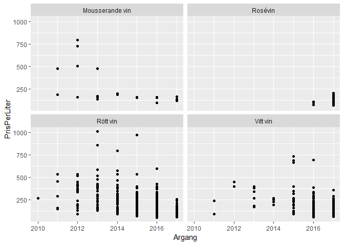

Class1
================

``` r
library(tidyverse, message(suppressMessages(TRUE)))
```

    ## -- Attaching packages -------------------------------------------- tidyverse 1.2.1 --

    ## v ggplot2 3.1.0     v purrr   0.2.5
    ## v tibble  1.4.2     v dplyr   0.7.7
    ## v tidyr   0.8.2     v stringr 1.3.1
    ## v readr   1.1.1     v forcats 0.3.0

    ## -- Conflicts ----------------------------------------------- tidyverse_conflicts() --
    ## x dplyr::filter() masks stats::filter()
    ## x dplyr::lag()    masks stats::lag()

``` r
Sortiment_hela <- read_csv("Class_files/systembolaget2018-10-08.csv")
```

    ## Parsed with column specification:
    ## cols(
    ##   .default = col_character(),
    ##   nr = col_integer(),
    ##   Artikelid = col_integer(),
    ##   Varnummer = col_integer(),
    ##   Prisinklmoms = col_double(),
    ##   Volymiml = col_double(),
    ##   PrisPerLiter = col_double(),
    ##   Saljstart = col_date(format = ""),
    ##   Utgått = col_integer(),
    ##   Argang = col_integer(),
    ##   Ekologisk = col_integer(),
    ##   Etiskt = col_integer(),
    ##   Koscher = col_integer(),
    ##   Pant = col_double()
    ## )

    ## See spec(...) for full column specifications.

``` r
Sortiment_hela <- Sortiment_hela %>% 
  mutate(Alkoholhalt = as.numeric(gsub("%", "", Alkoholhalt))/100)

Sortiment_hela <- Sortiment_hela %>%
  mutate(Varugrupp = ifelse(Varugrupp=="Röda","Rött vin",ifelse(Varugrupp=="Vita","Vitt vin",Varugrupp)))

MaxPriceName <- Sortiment_hela %>%
  filter(PrisPerLiter == max(PrisPerLiter)) %>%
  select(Namn)
```

Highland Park has the highest price per liter.

``` r
library(knitr)

Sortiment_ord <- Sortiment_hela %>%
  filter(SortimentText == "Ordinarie sortiment")

mostExpensive <- Sortiment_ord %>%
  arrange(desc(PrisPerLiter)) %>%
  select(Artikelid, Namn, Volymiml, Varugrupp, Alkoholhalt, PrisPerLiter) %>% 
  head(10)

kable(mostExpensive, caption = "Most expensive beverages in regular product range")
```

|  Artikelid| Namn                        |  Volymiml| Varugrupp       |  Alkoholhalt|  PrisPerLiter|
|----------:|:----------------------------|---------:|:----------------|------------:|-------------:|
|      48487| Highland Park               |       700| Whisky          |        0.457|       5707.14|
|      28900| Hennessy                    |       700| Cognac          |        0.400|       2141.43|
|       3971| Krug                        |       750| Mousserande vin |        0.120|       2132.00|
|       3985| Cuvée Sir Winston Churchill |       750| Mousserande vin |        0.125|       1933.33|
|     243091| The Glenlivet               |       700| Whisky          |        0.430|       1927.14|
|       3959| Dom Pérignon                |       750| Mousserande vin |        0.125|       1898.67|
|     303987| Glengoyne                   |       700| Whisky          |        0.430|       1855.71|
|     770889| Kavalan                     |       700| Whisky          |        0.586|       1855.71|
|     793965| Diplomático                 |       700| Rom             |        0.430|       1812.86|
|    3555520| Jura                        |       700| Whisky          |        0.440|       1712.86|

``` r
library(ggplot2)

ggplot(Sortiment_ord, aes(x = Alkoholhalt, y = PrisPerLiter, color = Varugrupp)) +
  geom_point() +
  scale_y_log10()
```


``` r
ggplot(Sortiment_ord, aes(Varugrupp, PrisPerLiter)) +
  geom_point() +
  scale_y_log10() +
  coord_flip()
```


``` r
wines <- Sortiment_ord %>% 
  filter(Varugrupp %in% c("Vitt vin", "Rött vin", "Rosévin", "Mousserande vin"),
         Argang %in% c(2010:2017))

ggplot(wines, aes(Argang, PrisPerLiter, color = Varugrupp)) +
  geom_point()
```


``` r
ggplot(wines, aes(Argang, PrisPerLiter)) +
  geom_point() +
  facet_wrap(~ Varugrupp)
```


